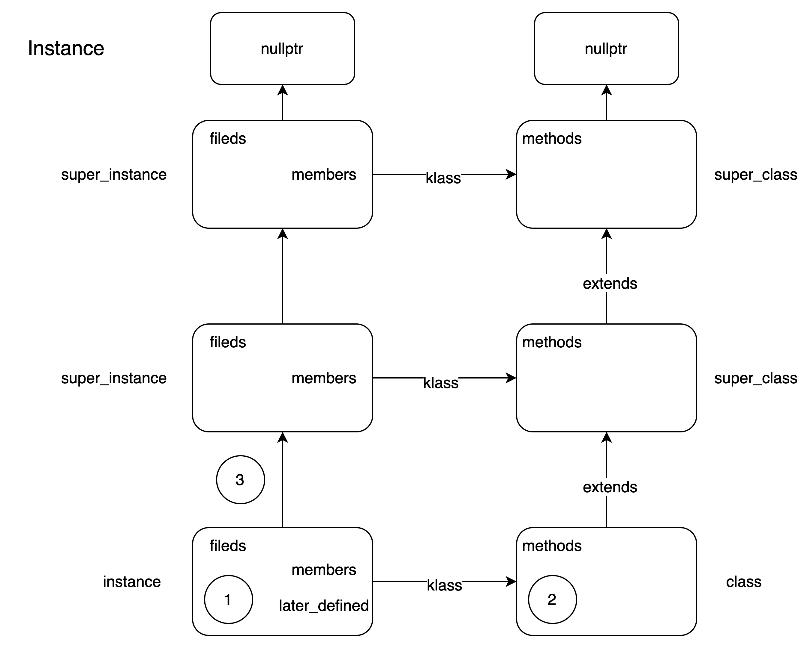
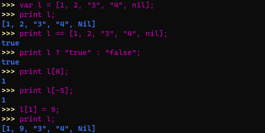
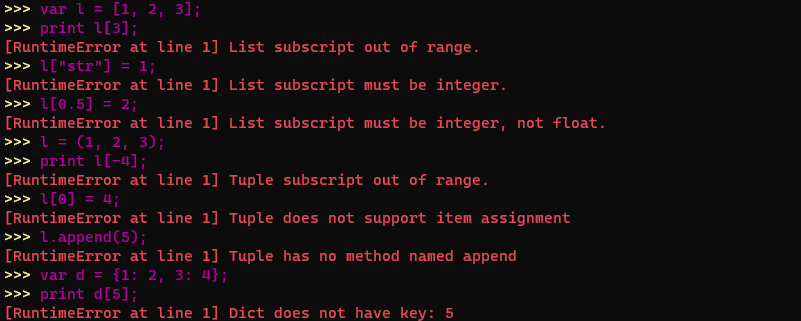

## 目录

[TOC]

<div STYLE="page-break-after: always;"></div>

## 工作量说明

Eagle语言为两位同学共同设计、开发，工作量各占50%

<div STYLE="page-break-after: always;"></div>

## 1. 语言的背景和目标

### 1.1 背景与动机

Eagle的设计目标，是想要设计一款类Python的解释型的动态类型语言，具备面向过程（OP），面向对象（OO）和部分函数式编程的特性。

之所以起名为Eagle，是因为在英文中Eagle的解释为“鹰”，而Python为“蛇”，鹰一般是蛇的天敌。当然，我们不可能在这么短的时间内实现一款超越Python的语言，我们只是希望Eagle能够向Python看齐，我们在很多语法的设计上，都参考了Python的语法，同时在一些使用的便捷性上和语言的功能扩展上又稍微引入了一些其他语言的特性，来扩展我们的功能。

现在Python语言在多个领域受到人们的追捧，比如机器学习，数据挖掘，后端开发等。其简单直白的语法规则和动态类型的语言设计，使得Python常常成为人们入门计算机编程的第一选择。这种简单直白的语法逻辑，和易于上手的便捷性，也是我们选择Python作为我们对标语言的主要原因，我们希望Eagle也能够成为成为一款易于上手，且功能强大的语言。

Eagle在尝试向Python看齐，但是又与Python在一些方面有所不同。


### 1.2 特性与目标

在对标Python的过程中，我们保留了Python中好用的语法功能进行实现：

1. 内置函数，如`help`，`len`，`input`，`globals`，`id`，`read_from_file`，`write_to_file`等等；
2. 实现了`List`，`Dict`，`Tuple`等内置容器；
3. 支持闭包；
4. 动态类型，将类型的处理全部交给解释器来完成，而不需要用户来考虑；
5. 支持实例化的类能够添加新的属性，如变量或者方法；
6. 支持面向对象和单继承，从继承实现的难度上和逻辑的清晰上，我们选择实现单继承；
7. 支持连续的赋值运算和连续的关系运算。

同时，在我们自己使用Python的过程中，我们也发现了一些问题，并选择其他语言好的部分来进行参考和实现：

1. 改变Python中的缩进规则，使用`{}`来区分不同的作用域，让代码更便于阅读；
2. 支持三元运算符；
3. 保留变量声明，在Python的使用中基本没有变量声明的环节，而有时候需要用到某个变量，需要先将其初始；
4. 支持更复杂的流处理，Python并不具备像java，scala一样方便的流处理单元；
5. 支持更复杂的字符串处理，没有类似java和c++那样多样的字符串处理方法；
6. 完善对匿名函数支持，不够简单直白且功能不足，而类似java中的`()->{}`表示，可能能够处理更复杂的逻辑，且配合流处理更易于上手；
7. 修改Python类中的声明，在Python中单独声明的成员变量是作为类变量来使用的，我们认为可能类似java的成员变量的声明方式，将这些变量作为实例的成员变量会更好一些；
8. 支持`this`和`super`关键字的使用，此处参考了java中对于这些关键字的使用；
9. 支持`switch-case`的表达式赋值，此处参考了scala中对于`swtich-case`的使用；
10. 类中，用户可自定义类的`toString()`，`equals()`，`hashcode()`，`isTruthy()`方法，使得用户定义的类可以进行：自定义的输出、自定义的比较方法、用作Dict的key值以及用以判断真值；

在Eagle中，我们还实现了EagleShell和PrettyPrint来支持丰富且多彩的命令行交互方式，方便用户将Eagle作为一个脚本语言来进行日常的使用。

Eagle语言的上述特性详见第5章——实现细节。

在语言特性方面，我们主要参考了以下语言：

* Python，Java，Scala，C++，Ruby


### 1.3 实现

* 在架构设计上，我们使用了Visitor模式作为解释器的主要架构，参考了以下开源项目的实现方案：

    * [Lox](https://github.com/munificent/craftinginterpreters)
    * [FlammingMyCompiler](https://github.com/mlzeng/CSC2020-USTC-FlammingMyCompiler)

    * [CPython](https://github.com/python/cpython)

* 在开发选择上，我们选择c++17作为我们的开发语言，我们希望给用户提供一个可执行的文件来作为我们解释器的入口，并且可以运行在windows，linux，macOS等常见操作系统上
* 在内存管理上，我们使用了c++17的智能指针`shared_ptr`来管理堆内存资源
* 在实现上，我们参考了java中的公共父类Object和面向对象的思想，在Eagle中也实现公共父类Object，所有Eagle中使用的对象均继承了Object，以此作为Eagle的开发基础
    * 我们也实现了java中的`InstanceOf`等函数，来辅助开发
* 在便捷使用上，我们仿照Python的命令行交互，开发了EagleShell，方便用户通过命令行交互的方式，来对Eagle进行使用和调试

<div STYLE="page-break-after: always;"></div>

## 2. 词法设计

### 2.1 Token设计

在Eagle中，Token包括四个基本成员变量，分别是：

* TokenType type：Token类型标识符
* int line：Token出现的行数，用于错误检查
* string text：Token对应的字符串
* Object literal：当该Token为基本类型，则literal为具体基本类型，否则为nullptr
  * Object为Eagle内置实现的公共父类


### 2.2 TokenType设计

在Eagle，TokenType主要可以分为5大类，分别是算术运算符，关系运算符，字面量标识符，关键字和基本符号，另外还有一个辅助标识符，用于Parser语法解析时辅助使用。

TokenType的作用是区分Lexer词法解析的分析结果，在Parser中通过不同的TokenType来进行语法解析。

#### 2.2.1 算术运算符

| 字符串 | TokenType    | 说明                       |
| ------ | ------------ | -------------------------- |
| -      | MINUS        | 一元运算负号；二元运算减法 |
| +      | PLUS         | 二元运算加法               |
| *      | MULTI        | 二元运算乘法               |
| /      | DIV          | 二元运算除法               |
| %      | MOD          | 二元运算取余               |
| =      | ASSIGN       | 二元运算赋值               |
| -=     | MINUS_ASSIGN | 二元运算减法并赋值         |
| +=     | PLUS_ASSIGN  | 二元运算加法并赋值         |
| *=     | MULTI_ASSIGN | 二元运算乘法并赋值         |
| /=     | DIV_ASSIGN   | 二元运算除法并赋值         |
| %=     | MOD_ASSIGM   | 二元运算取余并赋值         |

* 在Eagle中，赋值运算是有返回值的，返回值为赋值后的结果，所以将赋值运算符归为算数运算符

#### 2.2.2 关系运算符

| 字符串 | TokenType     | 说明                             |
| ------ | ------------- | -------------------------------- |
| ==     | EQUAL         | 检查左右操作数是否相等           |
| !=     | NOT_EQUAL     | 检查左右操作数是否不相等         |
| <      | LESS          | 检查左操作数是否小于右操作数     |
| <=     | LESS_EQUAL    | 检查左操作数是否小于等于右操作数 |
| >      | GREATER       | 检查左操作数是否大于右操作数     |
| >=     | GREATER_EQUAL | 检查左操作数是否大于等于右操作数 |

#### 2.2.3 字面量标识符

| TokenType  | 说明                         |
| ---------- | ---------------------------- |
| IDENTIFIER | 标识符，如 a，abc            |
| NUMBER     | 数字，如 1，1.2              |
| STRING     | 字符串，如 "abcd"            |
| BOOLEAN    | 布尔值，如 true，false       |
| NIL        | 空，如nil                    |
| LIST       | 列表，如 [1, true, "123"]    |
| DICT       | 字典，如 {1: 2, true: "abc"} |
| TUPLE      | 元组，如 (a, function, 1)    |

* 字面量标识符，部分字面量标识符可以在Lexer词法解析时直接解析出来，部分字面量标识符需要在Parser语法解析时通过分析嵌套表达式来解析
  * Lexer直接解析：IDENTIFIER，NUMBER，STRING，BOOLEAN
  * Parser嵌套解析：LIST，DICT，TUPLE

#### 2.2.4 关键字

| 字符串   | TokenType | 说明                |
| -------- | --------- | ------------------- |
| var      | VAR       | var变量声明关键字   |
| and      | AND       | 二元逻辑运算与      |
| or       | OR        | 二元逻辑运算或      |
| not      | NOT       | 一元逻辑运算非      |
| nil      | NIL       | 基本类型，空关键字  |
| for      | FOR       | for循环关键字       |
| while    | WHILE     | while循环关键字     |
| break    | BREAK     | break跳出循环       |
| continue | CONTINUE  | continue持续循环    |
| if       | IF        | if条件关键字        |
| else     | ELSE      | else条件关键字      |
| switch   | SWITCH    | switch条件关键字    |
| case     | CASE      | case条件关键字      |
| default  | DEFAULT   | default条件关键字   |
| stream   | STREAM    | stream流处理关键字  |
| def      | DEF       | def函数声明关键字   |
| class    | CLASS     | class类声明关键字   |
| super    | SUPER     | super类操作关键字   |
| this     | THIS      | this类操作关键字    |
| extends  | EXTENDS   | extends类继承关键字 |
| print    | PRINT     | print输出关键字     |
| return   | RETURN    | return函数返回      |

#### 2.2.5 基本符号

| 字符串 | TokenType        | 说明     |
| ------ | ---------------- | -------- |
| ,      | COMMA            | 逗号     |
| .      | DOT              | 点       |
| ;      | SEMICOLON        | 分号     |
| ?      | QUESTION_MARK    | 问好     |
| !      | EXCLAMATION_MARK | 感叹号   |
| (      | LEFT_PAREN       | 左小括号 |
| )      | RIGHT_PAREN      | 右小括号 |
| [      | LEFT_BRACKET     | 左中括号 |
| ]      | RIGHT_BRACKET    | 右中括号 |
| {      | LEFT_BRACE       | 左大括号 |
| }      | RIGHT_BRACE      | 右大括号 |
| ->     | RIGHT_ARROW      | 右箭头   |

#### 2.2.6 辅助标识符

| TokenType | 说明                                             |
| --------- | ------------------------------------------------ |
| END       | 在词法解析结束后，在末尾添加END标识最后一个Token |


### 2.3 Lexer设计

Eagle解释器中的Lexer词法解析，采用手动构造的方式来实现，没有依赖第三方支持。

#### 2.3.1 处理逻辑

* Eagle解释器主要将输入分为五类进行处理
  1. 可直接识别的字符：包括算数运算符，关系运算符，基本符号等
  2. 数字：需要按照NUMBER对应的格式，识别完整的数字，并初始化数字对应的BigFloat Object对象，存储到Token的literal字段中
  3. 字符串：在识别到`"`符号后，进入字符串的解析，需要将完整的字符串初始化为对应的String Object对象中，存储到Token的literal字段中
  4. 关键字/标识符：关键字和标识符有一样的解析逻辑，需要在解析之后判断该标识符是否为Eagle的关键字，并赋予对应的TokenType
  5. 特殊字符：
     * `\n, \t, \r`和空格，符合Eagle字符规范的输入会进行忽略处理，其中`\n`会让line的计数增加
     * 不符合Eagle字符规范的输入，会在Lexer语法解析的时候**报错**

#### 2.3.2 处理过程


<div STYLE="page-break-after: always;"></div>

## 3. 语法设计

### 3.1 EBNF设计

#### 3.1.1 Program入口 EBNF设计

```cpp
program ::= (declaration|statement)* ;
```

#### 3.1.2 Statement EBNF设计

* 声明

```cpp
declaration :: = class-declaration |
				 function-declaration |
				 variable-declaration ;

class-declaration ::= "class" identifier ("extends" identifier)?
					  "{" (variable-declaration|function-declaration)* "}" ;

function-declaration ::= "def" identifier "(" parameters? ")" block-statement ;
parameters ::= identifier ("," identifier)* ;

variable-declaration ::= "var" identifier ("=" expression)? ";" ;
```

* 语句

```cpp
statement ::= if-statement |
			  for-statement |
              while-statement |
              expression-statement |
			  print-statement |
			  return-statement |
			  break-statement |
			  continue-statement |
			  block-statement |
			  empty-statement;

if-statement ::= "if" "(" condition ")" statement
				 ("else" statement)? ;

for-statement ::= "for" "(" 
				  (variable-declaration | expression-statement | ";")?
				  expression? ";"
				  expression? 
				  ")"
				  statement ;

while-statement ::= "while" "(" expression ")" statement ;

expression-statement ::= expression ";" ;

print-statement ::= "print" expression ";" ;

return-statement ::= "return" expression ";" ;

break-statement ::= "break" ";" ;

continue-statement ::= "continue" ";" ;

block-statement ::= "{" (declaration|statement)* "}" ;

empty-statement ::= ";" ;
```

#### 3.1.3 Expression EBNF设计

```cpp
// Expression
expression ::= assignment_expression ;

assignment_expression ::= call ("="|"+" "="|"-" "="|"*" "="|"/" "="|"%" "=") 		
						  assignment_expression | ternary_if_else ;

ternary_if_else ::= logic_or ("?" ternary_if_else ":" ternary_if_else)? ;

logic_or ::= logic_and ("or" logic_and)* ;

logic_and ::= comparison ("and" comparison)* ;

comparison ::= term (("=="|"!="|">"|">="|"<"|"<=") term)* ;

term ::= factor (("-"|"+") factor)* ;

factor ::= unary (("*"|"/"|"%") unary)* ;

unary ::= ("!"|"-"|"not") unary | call ;

call ::= primary ("." identifier | ("[" expression "]")+ | "(" arguments? ")")* ;

primary ::= "true" | "false" | "nil" | "this" | "super" "." identifier |
			number | string | identifier | "(" expression ")" |
			"[" list_elements? "]" | "{" dict_elements? "}" | "(" tuple_elements? ")" |
			stream_expression | switch_expression | lambda_expression ;
```

#### 3.1.4 基本单元 EBNF设计

```cpp
list_elements ::= expression ("," expression)* ;

dict_elements ::= expression ":" expression ("," expression ":" expression)* ;

tuple_elements ::= (expression ",")? | expression ("," expression)+ ;

stream_expression ::= "stream" "(" expression ")" ("." identifier "(" call? ")")* ;

switch_expression ::= "switch" "(" expression ")" "{"
					  ("case" expression ":" expression ",")*
					  "default" ":" expression "}" ;

lambda_expression ::= "(" parameters? ")" "->" (expression | block-statement) ;

arguments ::= expression ("," expression) ;

number ::= digit+ ("." digit+)? ;

digit ::= "0"..."9" ;

string ::= "\"" <any char except \">* "\""
  
identifier ::= alpha (alpha|digit)* ;

alpha ::= "a"..."z"|"A"..."Z"|"_" ;
```


### 3.2 AST抽象语法树设计

抽象语法树（AST）是通过Parser语法解析，将Lexer词法解析的结果构造为Eagle对应的语言成分，在Eagle中主要分为Expression和Statement两类

在Eagle的AST抽象语法树中，入口为Program，是一个List\<Statement\>，里面包含多个Statement AST节点。在Expression AST节点和Statement AST节点中，它们的节点组成主要为Token，Expression，Statement，

#### 3.2.1 Expression AST节点设计

```cpp
Assign 				: Token name, Token operator, Expr value
Ternary 			: Expr condition, Expr then_expr, Expr else_expr
Compare 			: Expr first, List<Pair<Token, Expr>> others
Binary 				: Expr left, Token operator, Expr right
Unary 				: Token operator, Expr expr
Call 				: Expr callee, List<Expr> arguments, int line
Literal 			: Object value
Variable 			: Token name
Stream 				: Expr expr, List<Pair<Token, Expr>> operations
Switch 				: Expr expr, List<Pair<Expr, Expr>> case_results, Expr default_result
Lambda				: List<Token> params, Stmt body
InstanceSet 		: Expr object, Token name, Token operator, Expr value
InstanceGet 		: Expr object, Token name
ContainerSet		: Expr container, Expr subscript, Token operator, Expr value
ContainerGet		: Expr container, Expr subscript
This 				: Token keyword
Super 				: Token keyword, Token method
Sequence 			: Token type, List<Expr> elements
Associative 		: Token type, List<Pair<Expr, Expr>> elements
```

#### 3.2.2 Statement AST节点设计

```cpp
Class 		: Token name, Variable super_class, List<Var> members, List<Function> methods
Function 	: Token name, List<Token> params, List<Stmt> body
Var 		: Token name, Expr initializer
If 			: Expr condition, Stmt then_branch, Stmt else_branch
While 		: Expr condition, Stmt body
For       	: Stmt initializer, Expr condition, Stmt increment, Stmt body 
Expression	: Expr expression
Print 		: Expr print_value
Return 		: Expr return_value, int line
Break 		: Token keyword
Continue 	: Token keyword
Block 		: List<Stmt> statements
Empty     	:
```

#### 3.2.3 Eagle AST样例说明

##### InstanceSet AST样例说明

```java
class A {
	var b = 1;
}
A().b += 2;
```


##### ContainerSet AST样例说明

```java
var b = {1: 2, 3: 4};
b[3] = "4";
```


##### Function AST样例说明

```cpp
def func(a, b) {
	var c = a;
	return c + b;
}
var b = func(1, 2);
```


##### For AST样例说明

```java
for (var a = 1; a < 10; a += 1) {
	print a;
}
```


<div STYLE="page-break-after: always;"></div>

## 4. 语义说明

### 4.1 存储域

Store是Eagle的存储域，描述的是程序运行时的堆内存的使用。Location用于描述存储域中存储数据的位置，使用Location和辅助函数fetch可以查询存储域中的值，使用Location和update函数可以更新存储域中的值，allocate，deallocate等辅助函数更新存储域的使用情况。

* 语义函数

```
Store = Location → (stored Storable + undefined + unused)
```

* 辅助函数

```
empty_store: Store
allocate: Store → Store × Location
deallocate: Store × Location → Store
update: Store × Location × Storable → Store
fetch: Store × Location → Storable
```

* 辅助函数符号表示

```
empty_store = λloc.unused
allocate(sto) = let loc = any_unused_location(sto) in (sto[loc → undefined], loc)
deallocate(sto, loc) = sto[loc → unused]
update(sto, loc, stble) = sto[loc → stored stble]
fetch(sto, loc) = let stored_value (stored stble) = stble
				  	  stored_value (undefined) = fail
				  	  stored_value (unused) = fail
				  	  in stored_value (sto(loc))
```


### 4.2 环境域

标识环境域Environ，标识符域Identifier，可绑定体域Bindable，环境特性的映射关系如下：

* 语义函数

```
Environ = Identifier → (bound Bindable + unbound)
```

* 辅助函数

```
empty_environ: Environ
bind: Identifier × Bindable → Environ
overlay: Environ × Environ → Environ
find: Environ × Identifier → Bindable
```

* 辅助函数符号表示

```
empty-environ = λI.unbound
bind(I, bdble) = λI'. if I' = I then bound bdble else unbound
overlay(env', env) = λI. if env'(I) != unbound then env'(d) else env(d)
find(env, I) = 
	let bound_value(bound bdble) = bdble
		bound_value(unbound) = fail
	in bound_value(env(I))
```


### 4.3 原始域表达式

Primary原始域中包含：真值域Boolean，空值域Nil，字符串域String，数值域Number，容器域Container，标识符域Identifier。

* 语义函数

```
Primary = Value → (Boolean + Nil + String + Number + Container + Identifier)
```

* 辅助函数

```
fetch_variable: Store × Identifier → Value
instance_get: Identifier × Bindable × Identifier → Value
container_get: Environ × Identifier × Expression → Value
```

* 辅助函数符号表示

```
fetch_variable(sto, variable loc) = fetch(sto, loc)
instance_get(instance, env, member) = 
	let instance_sto = find(env, instance) in
	fetch_variable(instance_sto, member)
container_get(container, env, index) = 
	let container_sto = find(env, container) in
	fetch_variable(container_env, index)
```


### 4.4 表达式

使用Expression来表示表达式域，表达式主要可以分为取值表达式，赋值表达式，算术表达式，关系表达式和逻辑表达式。

* 语义函数

```
evaluate: Expression → (Environ → Store → Value)
```

* 辅助函数

```
update_variable: Store × Identifier × Value → Store
// 赋值表达式
instance_set: Identifier × Bindable × Identifier × Value → Environ
container_set: Environ × Identifier × Expression × Value → Environ
// 算术表达式
plus: Value × Value → Value
minus: Number × Number → Number
multi: Number × Number → Number
div: Number × Number → Number
mod: Number × Number → Number
// 关系表达式
equal: Value × Value → Boolean
not_equal: Value × Value → Boolean
less: Value × Value → Boolean
less_equal: Value × Value → Boolean
greater: Value × Value → Boolean
greater_equal: Value × Value → Boolean
// 逻辑表达式
not: Boolean → Boolean
and: Boolean × Boolean → Boolean
or: Boolean × Boolean → Boolean
```

* 辅助函数符号表示

```
update_variable(sto, variable loc, stble) = update(sto, loc, stble)
// 赋值表达式
instance_set(instance, env, member, sto, value) = 
	let instance_var = intance_get(instance, env, member) in
	update_variable(sto, instance_var, value)
container_set(container, env, index, sto, value) =
	let container_var = container_get(container, env, index) in
	update_variable(sto, container_var, value)
// 算术表达式
plus(left, right) = let plus_value (Number left, Number right) = left + right
						plus_value (String left, String right) = left + right // 字符串拼接
						plus_value (Value left, Value right) = fail
						in plus_value (left, right)
minus(left, right) = left - right
multi(left, righ) = left * right
divide(left, right) = left / right
mod(left, right) = left % right
// 关系表达式
equal(left, right) = 
	if left == right
	then true
	else false
not_equal(left, right) = 
	if left != right
	then true
	else false
less(left, right) =
	let less_value (Number left, Number right) = 
			if left < right then true else false
		less_value (String left, String right) = 
			if left < right then true else false // 比较字符串字典序
		less_value (Value left, Value right) = fail
		in less_value (left, right)
less_equal(left, right) =
	let less_equal_value (Number left, Number right) = 
			if left <= right then true else false
		less_equal_value (String left, String right) = 
			if left <= right then true else false // 比较字符串字典序
		less_equal_value (Value left, Value right) = fail
		in less_equal_value (left, right)
greater(left, right) =
	let greater_value (Number left, Number right) = 
			if left > right then true else false
		greater_value (String left, String right) = 
			if left > right then true else false // 比较字符串字典序
		greater_value (Value left, Value right) = fail
		in greater_value (left, right)
greater_equal(left, right) =
	let greater_equal_value (Number left, Number right) = 
			if left >= right then true else false
		greater_equal_value (String left, String right) = 
			if left >= right then true else false // 比较字符串字典序
		greater_equal_value (Value left, Value right) = fail
		in greater_value (left, right)
// 逻辑表达式
not(value) = !value
and(left, right) =
	if left == true && right == true
	then true
	else false
or(left, right) = 
	if left == true || right == true
	then true
	else false
```

* 语义方程

```
// 取值表达式
evaluate [I.member] env sto =
	intance_get(I, env, member)
evaluate [I[E]] env sto = 
	let index = evaluate E env sto in
	container_get(I, env, index)
// 赋值表达式
evaluate [I = E] env sto =
	let val = evaluate E env sto in
	update_variable(sto, I, val)
evaluate [I.member = E] env sto =
	let val = evaluate E env sto in
	instance_set(I, env, member, sto, val)
evaluate [I[E1] = E2] env sto = 
	let index = evaluate E1 env sto in
	let val = evaluate E2 env sto in
	container_set(I, env, index, sto, val)
// 算术表达式
evaluate [E1 + E2] env sto =
	let left = evaluate E1 env sto in
	let right = evaluate E2 env sto in
	plus(left, right)
evaluate [E1 - E2] env sto =
	let left = evaluate E1 env sto in
	let right = evaluate E2 env sto in
	minus(left, right)
evaluate [E1 * E2] env sto =
	let left = evaluate E1 env sto in
	let right = evaluate E2 env sto in
	multi(left, right)
evaluate [E1 / E2] env sto =
	let left = evaluate E1 env sto in
	let right = evaluate E2 env sto in
	divide(left, right)
evaluate [E1 % E2] env sto =
	let left = evaluate E1 env sto in
	let right = evaluate E2 env sto in
	mod(left, right)
// 关系表达式
evaluate [E1 == E2] env sto =
	let left = evaluate E1 env sto in
	let right = evaluate E2 env sto in
	equal(left, right)
evaluate [E1 != E2] env sto =
	let left = evaluate E1 env sto in
	let right = evaluate E2 env sto in
	not_equal(left, right)
evaluate [E1 < E2] env sto =
	let left = evaluate E1 env sto in
	let right = evaluate E2 env sto in
	less(left, right)
evaluate [E1 <= E2] env sto =
	let left = evaluate E1 env sto in
	let right = evaluate E2 env sto in
	less_equal(left, right)
evaluate [E1 > E2] env sto =
	let left = evaluate E1 env sto in
	let right = evaluate E2 env sto in
	greater(left, right)
evaluate [E1 >= E2] env sto =
	let left = evaluate E1 env sto in
	let right = evaluate E2 env sto in
	greater_equal(left, right)
// 逻辑表达式
evaluate [not E] env sto =
	let value = evaluate E env sto in
	not(value)
evaluate [E1 and E2] env sto =
	let left = evaluate E1 env sto in
	let right = evaluate E2 env sto in
	and(left, right)
evaluate [E1 or E2] env sto =
	let left = evaluate E1 env sto in
	let right = evaluate E2 env sto in
	or(left, right)
// switch-case表达式
evaluate [switch(E) case E1: V1, case E2: V2, default V3] env sto =
	let condition = evaluate E env sto in
	let case_1 = evaluate E1 env sto in
	if condition == case_1
	then evaluate V1
	else
	let case_2 = evaluate E2 env sto in
	if condition == case_2
	then evaulate V2
	else
	evaluate V3
// 其他表达式
evaluate [(E)] env sto = evaluate E env sto
```


### 4.5 语句

* 使用Statement来表示语句域，语句主要可以分为条件语句，循环语句，表达式语句，输出语句，空语句。

* 语义函数

```
execute: Statement → (Environ → Store → Store)
```

* 语义方程

```
execute [if C then S1 else S2] env sto = 
	if evaluate C env sto = Boolean true
	then execute S1 env sto
	else execute S2 env sto
execute [for (S1; C; S2) S3] env sto =
	execute S1 env sto
	let execute_for env sto = 
		if evaluate C env sto = Boolean true
		then execute_for env (execute S2 env sto (execute S3 env sto))
		else sto
	in
	execute_for
execute [while C do S] env sto = 
	let execute_while env sto =
		if evaluate C env sto = Boolean true
		then execute_while env (execute S env sto)
		else sto
	in
	execute_while
execute [E] env sto = evaluate E env sto
execute [print E] env sto =
	let output = evaluate E env sto in
	print output
execute [] env sto = sto
```


### 4.6 声明

* 在Eagle中声明分为变量声明，函数声明和类的声明

#### 变量

* 语义方程

```
execute [var V = E] env sto =
	let var = identifier V env sto in
	let val = evaluate E env sto in
	update_variable(allocate(sto), var, val)
```

#### 函数

在Eagle关于函数，分为函数的声明与形式参数Formal Parameters，以及函数的调用与实际参数Actual Parameters。

* 函数抽象

```
Function = Argument → Value
Function = Argument → Store → Value
```

* 辅助函数

```
bind_parameter: Formal_Parameter → (Argument → Environ)
give_argument: Actual_Parameter → (Environ → Argument)
```

* 辅助函数符号表示

```
bind_parameter(I, arg) = bind(I, arg)
give_argument(E) env sto = let arg = evluate E env sto
```

* 语义方程

```
// 函数声明
execute [def I(FP) S] env =
	let func arg =
		let parenv = bind_parameter(I, FP) in
		evaluate S(overlay(parenv, env))
	in
	(bind(I, def func))
// 函数调用
evaluate [I(AP)] env =
	let function func = find(env, I) in
	let arg = give_argument(AP) env in
	func arg
```

#### 类

* 类抽象

 ```
 Class = Class_Declaration → (Environ → Store → Environ × Store)
 ```

* 语义方程

```
execute [class I1 extends I2 VD FD] env sto =
	let super_class = find(env, I2) in
	let class sto' = 
		let env = overlay(bind(I, class class), overlay(super_class, env)) in
		let variables = execute VD env sto
		let functions = execute FD env sto
		in
		(bind(I1, class class), sto')
```

<div STYLE="page-break-after: always;"></div>

## 5. 实现细节

### 5.1 总述

Eagle语言的解释器使用c++17实现，可以运行在windows，linux，macOS等常见操作系统上。

解释器的整体实现思路为使用访问者模式（Visitor Pattern），在通过词法分析和语法分析得到AST后，从根节点开始递归地访问AST的每一个节点，并针对不同的AST节点类型执行不同的动作，并最终完成源代码的解释执行。若在执行过程中发生错误，则抛出`EagleRuntimeError`（运行时错误）异常到解释器的最顶层，解释器捕捉到该异常后打印错误信息并停止解释执行。

使用面向对象的编程范式完成代码的具体实现，将模块功能封装在相应的类中。为了方便管理内存，使用c++17的智能指针`shared_ptr`管理堆内存资源。


### 5.2 Object类

#### 5.2.1 使用Object类的原因

出于以下两个方面的原因，程序中使用自定义的Object类作为公共父类：

+ 在访问AST节点时，需要使用RTTI（Run Time Type Identification，运行时类型识别）来确定子节点的类型，从而确定处理逻辑；
+ Eagle语言的值Value没有具体的类型，可以是字符串、数值、列表等等，为了方便实现，将Value定义为公共父类的指针，并在解释执行时通过RTTI确定子节点的类型并选择相应的处理方法。

出于以上两点考虑，定义Object类作为所有AST节点类型和Eagle所有值类型的公共父类，其继承关系如下页图所示

其中：

+ 上半部分为AST节点类型，在3.2节中已介绍
+ 下半部分为Eagle中的值类型，将在后续章节中介绍，包括：
	+ 空值 Null
	+ 布尔值 Boolean
	+ 数值 Number
	+ 具有内置方法的类型 BuiltInClass，包括：
		+ 容器类型 Container，包含：列表 List，元组 Tuple，字典 Dict
		+ 字符串类型 String
	+ 流类型 Stream
	+ 对象类型（即类实例）Instance
	+ 可调用类型 Callable，包括：
		+ 用户自定义类 EagleClass
		+ 用户自定义函数 EagleFunction
		+ 匿名函数（lambda表达式）Lambda
		+ 内置函数 BuiltInFunction
		+ 其他


#### 5.2.2 Object类的方法

考虑到Eagle的各种值类型具有一些公共的行为，参考java语言Object类的方法，设计Object类具有以下四个可继承的方法：

1. `string toString()`
	+ 含义：返回该Eagle值的字符串表示形式
	+ 缺省行为：返回字符串`"<object at address>"`，其中address为该值的内存地址
2. `bool equals(Object obj)`
	+ 含义：返回该Eagle值是否与另一个Eagle值`obj`相等
	+ 缺省行为：返回自身的内存地址是否与另一个Eagle值的内存地址相等
3. `size_t hashcode()`
	+ 含义：返回该Eagle值的hash值
	+ 缺省行为：返回该值的内存地址
4. `bool isTruthy()`
	+ 含义：返回该Eagle值作为布尔值进行判断时，是否为真
	+ 缺省行为：返回true


### 5.3 内置类型

#### 5.3.1 Null

Null为Eagle中的空值，当用户显式地将某个变量赋值为`nil`时，该变量的值为Null；或当某个函数没有通过return语句返回时，该函数的返回值为Null.

Null不具有任何成员变量，仅重写了父类Object的四个方法：

1. `string toString()`：返回字符串`"Nil"`
2. `bool equals(Object obj)`：所有Null类型的值均相等，因此该方法返回`obj`的类型是否为Null
3. `size_t hashcode()`：返回0
4. `bool isTruthy()`：返回false

#### 5.3.2 Boolean

Boolean为Eagle中的布尔值，当用户将某个变量显式地赋值为`true`，`false`，或赋值为某个逻辑表达式的结果时，该变量的值类型为Boolean

Boolean具有类型为bool的成员变量value，表示该Boolean值的真假，并重写了父类Object的四个方法：

1. `string toString()`：若value为真，则返回字符串`"true"`，否则返回字符串`"false"`
2. `bool equals(Object obj)`：仅当`obj`的类型也为Boolean，且二者的value值相等时，返回true，否则返回false
3. `size_t hashcode()`：返回value的hash值（使用c++内置的hash函数）
4. `bool isTruthy()`：返回value

#### 5.3.3 Number

Number为Eagle中的数值，包括高精度整数和高精度浮点数，并支持任意精度的结果精确的数值基本运算（加减乘除模）

Number的实现基于开源的[BigFloat](https://github.com/Mariotti94/BigFloat)，其包含以下成员变量：

+ sign：表示Number的符号
+ number：类型为`deque<char>`，倒序存储了Number的十进制表示的每一位的数字
+ decimals：类型为`int`，表示Number小数点的位置

Number实现了数值基本运算方法、比较方法、与int、double、string类型的相互转换方法等，并重写了父类Object的四个方法：

1. `string toString()`：返回数值的字符串表示形式，如-1.23返回`"-1.23"`
2. `bool equals(Object obj)`：若`obj`也为Number类型，则从最高位逐位进行比较，否则返回false
3. `size_t hashcode()`：返回数值的字符串表示的hash值（使用c++内置的hash函数）
4. `bool isTruthy()`：若数值不为0，则返回true，否则返回false

#### 5.3.4 Callable

Callable为Eagle中的可调用类型，包括EagleClass, EagleFunction, Lambda等，这些对象具有相同的公共行为，即通过`()`运算符、传入参数并进行函数调用。可将该行为抽象为如下的抽象方法：

```c++
Object call(vector<Object> arguments)
```

所有Callable的子类均需要实现该方法。

该类型与AST中Call节点的处理紧密相关，具体而言，对Call节点进行解释执行时，需要判断子节点callee进行evaluate后的结果，是否为Callable类型。若否，则表示该callee不可被调用，此时需要报错；若是，则调用该Callable类型的call方法即可。

#### 5.3.5 BuiltInClass

BuiltInClass表示Eagle中具有内置方法的类型，包含String，Container等。这些类型的值具有相同的抽象行为，即可以通过形如`instance.method(params)`对内置方法进行调用，例如：

+ 若`s`为字符串类型，则可以通过`s.size()`获得`s`的长度；
+ 若`l`为列表类型，v为任意Eagle值类型，则可以通过`l.append(v)`将`v`添加到`l`的末端

对于上述行为的解释执行，分为两个阶段：

1. 处理InstanceGet节点：通过`method`的名称，获取对应的内置方法的函数指针`method_f`，将其与该Eagle值的指针`instance`存储到`BuiltInClassCall`对象中并返回给上层节点，其中：
	+ `method_f`为静态函数指针类型，其返回值类型为Object，第一个参数类型为BuiltInClass，代表需要执行内置方法的Eagle值；第二个参数类型为`vector<Object>`，即上层Call节点中的参数；
	+ `BuiltInClassCall`是一个`Callable`类型；
2. 处理Call节点：调用上一步获得的`BuiltInClassCall`对象的`call`方法，通过调用`method_f(instance, params)`来执行对应的内置方法，其中`params`为Call节点中的参数，类型为`vector<Object>`。

上述处理流程如下图所示，总体而言是一个Callback过程。


分析上述过程，可以发现BuiltInClass的抽象行为为，通过方法名获取对应的内置方法的函数指针，将该抽象行为定义为抽象方法`GetMethod(string name)`，其子类需要实现该方法。

#### 5.3.6 Container

Container表示Eagle中的容器，包含List, Tuple和Dict，是Eagle中的一类BuiltInClass。

Eagle中，Container的抽象行为包括：

1. `Object get(Object subscript)`：使用`[]`运算符，通过下标获取容器值；
2. `void set(Object subscript, Object value)`：使用`[]`运算符，通过下标设置容器值；
3. `Number size()`：获取容器大小；
4. `vector<Object> iterator()`：获取容器的迭代元素序列，从而对容器进行迭代

将在后续章节中介绍List, Tuple, Dict三种容器的具体实现以及具有的内置方法。

#### 5.3.7 List

List为Eagle中的**可变**的**线性有序**容器，可存储任意类型的Eagle值，具体而言，使用成员变量`vector<Object> elements`来存储容器内包含的元素。

List作为一类Eagle容器，同时也作为一种Eagle值类型，重写了以下方法：

+ Container的方法：

	+ `Object get(Object subscript)`：首先进行安全检查，即判断`subscript`是否为Number类型、是否为整数且是否没有越界。若是，则返回`elements`对应位置的Eagle值，否则报错；
	+ `void set(Object subscript, Object value)`：首先进行与`get`相同的安全检查，若通过检查则将`elements`对应位置的值设置为value，否则报错；
	+ `Number size()`：即返回`elements`的大小
	+ `vector<Object> iterator()`：List的迭代即为对其中包含的元素进行迭代，因此返回`elements`

+ Object的方法：

	+ `string toString()`：将`elements`中所有Eagle值的`toString`的结果依次拼接起来，并使用`, `分隔，将得到的字符串在左右两端分别用`[`和`]`包裹后返回。例如，包含元素`1.1`和`"2.2"`的List的`toString`结果为[1.1, "2.2"]`；

	+ `bool equals(Object obj)`：当两个List包含完全相同的元素且**顺序一致**时，可认为这两个List相同。因此该函数处理流程为：

		+ 使用RTTI判断obj是否为List类型，若是则将其转化为`List another`，否则返回false；

		+ 判断二者的元素个数是否相同，若是则继续比较，否则返回false；

		+ 使用`equals`方法，逐个比较`this.elements`与`another.elements`中的元素是否相同，即

			`this.elements[i].equals(another.elements[i])`；

		+ 若上述比较的结果均为true，则返回true，否则返回false；

	+ `size_t hashcode()`：首先计算每个元素的hash值（通过`elements[i].hashcode()`），然后使用某种确定的**顺序有关**算法（例如移位加法），通过这些值计算出新的hash值并返回。这种计算方式保证了，两个通过`equals`方法进行比较后相等的List对象，其hash值也必定相同；

	+ `bool isTruthy()`：可认为非空的List为真值，因此该函数返回`elements`是否不为空

此外，List是一种BuiltInClass，参考python，实现了以下常用的List内置方法：

+ `size() - Number`：返回List内元素个数；
+ `empty() - Boolean`：返回List是否为空；
+ `append(Object value) - Null`：将value添加到List的末尾，无返回值（即返回值为`Null`，下略）；
+ `clear() - Null`：清空List；
+ `contains(Object value) - Boolean`：返回List内是否包含value，使用`equals`方法逐个进行判断；
+ `count(Object value) - Number`：返回List内包含多少个value，使用`equals`方法逐个进行判断并计数；若不包含，则返回0；
+ `insert(Number index, Object value) - Null`：在List中插入新的元素value，其下标（位置）为index，其后面的元素则向后移动一位；若index过小或过大，则插入位置为List元素序列头部和尾部；
+ `remove(Object value) - Number`：移除List中出现的value（使用`equals`方法逐个进行判断）；若List中不包含value，则不做任何处理；若List中包含多个value，则仅移除第一个；
+ `pop() - Null`：移除List尾部的元素；若List为空，则不做任何处理；
+ `reverse() - Null`：反转List中的元素顺序。

#### 5.3.8 Tuple

Tuple为Eagle中的**不可变**的**线性有序**容器，可存储任意类型的Eagle值，与List基本类似，同样使用成员变量`vector<Object> elements`来存储容器内包含的元素。

与List相同，Tuple重写了以下方法：

+ Container的方法：
	+ `Object get(Object subscript)`：与List相同，首先进行安全检查，即判断`subscript`是否为Number类型、是否为整数且是否没有越界。若是，则返回`elements`对应位置的Eagle值，否则报错；
	+ `void set(Object subscript, Object value)`：由于Tuple不可变，不支持对元素进行赋值，因此该方法直接报错；
	+ `Number size()`：即返回`elements`的大小
	+ `vector<Object> iterator()`：Tuple的迭代即为对其中包含的元素进行迭代，因此返回`elements`
+ Object的方法：
	+ `string toString()`：与List类似，将`elements`中所有Eagle值的`toString`的结果依次拼接起来，并使用`, `分隔。不同的是将得到的字符串在左右两端分别用`(`和`)`包裹后返回。例如，包含元素`1.1`和`"2.2"`的Tuple的`toString`结果为`(1.1, "2.2")`；此外，当Tuple中仅包含一个元素时，会添加额外的`,`从而与括号表达式区分开，例如包含元素`1.1`的Tuple的`toString`结果为`(1.1,)`；
	+ `bool equals(Object obj)`：当两个Tuple包含完全相同的元素且**顺序一致**时，可认为这两个Tuple相同。因此该函数处理过程与List的`equals`方法类似；
	+ `size_t hashcode()`：与List类似，首先计算每个元素的hash值，然后使用某种确定的**顺序有关**算法（例如移位加法），通过这些值计算出新的hash值并返回。这种计算方式保证了，两个通过`equals`方法进行比较后相等的Tuple对象，其hash值也必定相同；
	+ `bool isTruthy()`：可认为非空的Tuple为真值，因此该函数返回`elements`是否不为空

此外，Tuple是一种BuiltInClass，参考python，实现了以下常用的Tuple内置方法：

+ `size() - Number`：返回Tuple内元素个数；
+ `empty() - Boolean`：返回Tuple是否为空；
+ `count(Object value) - Number`：返回Tuple内包含多少个value，使用`equals`方法逐个进行判断并计数；若不包含，则返回0；
+ `contains(Object value) - Boolean`：返回Tuple内是否包含value，使用`equals`方法逐个进行判断；

#### 5.3.9 Dict

Dict为Eagle中的可变的**关系型无序**容器，可存储任意类型的、形如(key, value)的Eagle值对。

+ 由于Eagle中的值类型均具有hashcode函数，均可求hash值，因此出于效率的考量，使用c++的`unordered_map`存储Dict的元素，其中`unordered_map`的键值为`key.hashcode()`，存储的值为(key, value)对
+ 考虑到哈希冲突的问题，实际上`unordered_map`中存储的值应为(key, value)对的序列，其中，同一序列的所有(key, value)对的`key.hashcode()`相同

基于上述两点，Dict的实现方案中使用如下的成员变量存储容器内包含的元素：

```c++
unordered_map<size_t, vector<pair<Object, Object>>> elements
```

Dict的存储模型如下图所示：


与List、Tuple相同，Dict重写了以下方法：

+ Container的方法：

	+ `Object get(Object k)`：返回Dict中以`k`为键值的(key, value)对的value值，若不存在，则报错；

	+ `void set(Object k, Object v)`：将Dict中以`k`为键值的(key, value)对的value值设置为v，若不存在，则将`(k, v)`插入Dict中；

	+ `Number size()`：即返回`elements`包含的(key, value)对的数量。由于elements需要进行遍历后才能获取其中包含的元素总数，出于效率的考量，使用成员变量`int element_cnt`记录元素数量，并在插入删除元素时维护该变量的值；
	+ `vector<Object> iterator()`：可认为对Dict的迭代即为对其所有key值的迭代，因此该方法返回所有key值组成的序列；

+ Object的方法：

	+ `string toString()`：首先使用 `: ` 拼接每个(key, value)对的key的`toString`结果和value的`toString`结果，然后使用`, `将上述字符串拼接起来，最后将得到的字符串在左右两端分别用`{`和`}`包裹后返回。例如，包含元素(1, 2)和(3, 4)的Dict的`toString`结果为 `"{1: 2, 3: 4}"`；由于Dict为无序容器，因此`toString`结果中元素的打印顺序可能与添加到Dict中的顺序不同；
	+ `bool equals(Object obj)`：当两个Dict包含完全相同的元素时，可认为这两个Dict相等。由于元素存储顺序的不一致并不影响两个Dict是否相等，因此使用如下的流程进行相等判断：
		+ 使用RTTI判断obj是否为Dict类型，若是则将其转化为`Dict another`，否则返回false；
		+ 比较二者的元素数量是否相同，若相同则继续比较，否则返回false；
		+ 对于Dict中所有的键值对(key1, value1)，判断`another`是否包含键值对(key2, value2)，并满足：`key1 == key2 && value1 == value2`；
		+ 若上述过程均满足，则返回true；若有一例不满足，则返回false；
	+ `size_t hashcode()`：首先计算每个键值对key和value的hash值，并将二者异或得到所有键值对的hash值，然后使用某种确定的**顺序无关**算法（例如加法），通过这些值计算出新的hash值并返回。这种计算方式保证了，两个通过`equals`方法进行比较后相等的Dict对象，其hash值也必定相同；
	+ `bool isTruthy()`：可认为非空的Dict为真值，因此该函数返回`element_cnt`是否不为0

此外，Dict是一种BuiltInClass，参考python，实现了以下常用的Dict内置方法：

+ `size() - Number`：返回Dict内键值对个数；
+ `clear() - Null`：清空Dict；
+ `get_value(Object k) - Object`：返回Dict中以`k`为键值的(key, value)对的value值，若不存在，则返回`Null`。具体实现与`get`方法类似；
+ `put(Object k, Object v) - Null`：将键值对(k, v)插入Dict中，若已存在，则覆盖。具体实现与`set`方法类似；
+ `contains_key(Object k) - Boolean`：返回Dict中是否包含键`k`；
+ `contains_value(Object v) - Boolean`：返回Dict中是否包含值`v`，遍历Dict中的所有键值对，通过`equals`方法比较判断；
+ `remove(Object k) - Null`：移除Dict中键为k的键值对，若不存在，则不进行任何处理。与`get`方法类似，需要进行两次查找。此外，成功移除时需要更新`element_cnt`的值；
+ `keys() - Tuple`：返回Dict所有的key值组成的不可变序列Tuple；
+ `values() - Tuple`：返回Dict所有的value值组成的不可变序列Tuple；
+ `items() - Tuple`：返回所有(key, value)对组成的不可变序列Tuple，其中每一个元素均为二元的Tuple；

#### 5.3.10 String

String为Eagle中的字符串值类型，其使用成员变量`string str`来存储具体的字符串值。String重写了Object类的四个方法：

1. `string toString()`：在`str`的两侧加上`""`包裹后返回
2. `bool equals(Object obj)`：若`obj`也为String类型，则比较二者的`str`是否相同，否则返回false
3. `size_t hashcode()`：返回`str`的hash值（使用c++内置的hash函数）
4. `bool isTruthy()`：可认为字符串在不为空时为真值，因此该函数返回`str`是否不为空串

此外，String是一种BuiltInClass，参考python, java, c++等多种语言，实现了以下常用的String内置方法：

+ `size() - Number`：返回String的长度；
+ `empty() - Number`：返回String是否为空串；
+ `char_at(Number index) - String`：返回String中位置在index的字符
+ `count(String substr) - Number`：返回String中包含子串`substr`的个数，若不包含，则返回0
+ `find(String substr) - Number`：返回String中，子串`substr`首次出现的位置，若不存在，则返回-1；
+ `upper() - String `：将String中所有小写字母大写，并返回新字符串；不改变原String的值；
+ `lower() - String `：将String中所有大写字母小写，并返回新字符串；不改变原String的值；
+ `split(String substr) - List`：使用子串`substr`分割String，将分割后的所有字符串组成可变序列List并返回；不改变原String的值；
+ `replace(String target_str, String new_str) - String`：将String中所有子串`target_str`替换为`new_str`，生成新的字符串并返回；不改变原String的值；

#### 5.3.11 Stream

#### (1) Stream的定义

Stream为Eagle中的流，参考java语言的流，将Eagle的Stream定义为一系列操作的集合，例如：

```
stream([1, 2, 3]).map((x) -> x*x).filter((x) -> x >= 4).for_each((x) -> {print x;});
```

可以看出，Stream主要由两个部分组成：初始值`initial_value`，操作集合`operations`。

+ `Container initial_value`：Stream要求其初始值为一个可迭代的Eagle值类型，即为一个容器类型；
+ `vector<pair<string, Object>>`：Stream的操作集合为一个序列，其中每一个操作由操作名称和操作参数组成。

可将Stream的操作分为**终结方法**和**非终结方法**：

+ 非终结方法：执行该操作得到的结果仍是一个流，例如`map`, `filter`, `limit`等；
+ 终结方法：执行该操作得到的结果不是一个流，而是其他的Eagle值类型，例如`count`, `to_list`, `for_each`等。

由于仅有Stream对象才能进行流操作，因此一个Stream对象最多只能有一个终结方法，且必须位于操作序列的末尾，称这样的Stream对象为**终结流**，其他Stream对象为**非终结流**。

#### (2) Stream的运算：急求值与懒求值

当定义一个流并进行运算时，根据流的类型不同，用户的期望也有所不同：

+ 对终结流进行运算时，用户期望得到一个运算后的结果，因此需要立即进行求值，称这种求值方式为急求值；
+ 对非终结流进行运算时，用户实际上仅仅是定义了一系列流操作，并没有期望流操作的结果。此外，此时流操作的结果仍为一个流，用户不关心它的值，也没有必要耗费额外的内存去存储它的值。因此，对于非终结流，可以暂缓求值过程，直到用户调用了终结方法后再进行，称这种求值方式为懒求值。

急求值与懒求值的区别可参考如下示例：

```
>>> stream(["c++", "java", "python"]).map((x) -> {print x; return x;}).count();
c++
java
python
3
// 终结流，急求值，输出了语言名称
>>> stream(["c++", "java", "python"]).map((x) -> {print x; return x;});
// 非终结流，懒求值，没有输出了语言名称
```

使用如下方案实现急求值-懒求值机制：

+ 对于终结流的运算，按操作序列的顺序，对初始值的每一个迭代元素进行操作，并返回最终的终结方法操作结果；
+ 对于非终结流的运算，初始化Stream对象后，不进行任何操作，返回Stream对象本身。

#### (3) Stream的内置方法的调用

当对非终结流进行运算后，得到的是一个流对象`stream`。类似BuiltInClass，此时可对该流对象进行形如`stream.method(params)`的 “*内置方法调用* ”。

但是，不同于BuiltInClass的内置方法调用是一次普通的函数调用，参考java语言的流机制，Eagle中将Stream对象的 “*内置方法调用* ” 定义为一个新的流的生成过程，包括以下几个步骤：

1. 使用原Stream对象（拷贝）生成一个新的Stream对象；
2. 设置原Stream对象的状态为`executed`，即同一个Stream不可进行多次 “*内置方法调用* ” ；
3. 使用急求值-懒求值机制，对新的Stream对象进行运算，并返回运算结果。

可参考如下示例：

```
>>> var s1 = stream([1, 2, 3]).filter((x) -> x > 1);
>>> print s1.count();
2
>>> print s1.limit(1).count();
[RuntimeError at line 1] Stream should not be executed repeatedly
```

具体实现方案中，与BuiltInClass类似，Stream同样借助一个中间结构StreamCall，通过一个Callback过程完成上述Stream对象的 “*内置方法调用* ”，包含两个阶段：

1. 处理InstanceGet节点：生成新的Stream对象，改变原Stream对象的状态，将新的Stream对象与操作的名称封装在StreamCall结构中，并返回给上层节点；
2. 处理Call节点：调用上一步获得的`StreamCall`对象的`call`方法，具体而言：将操作名称与操作参数组成一个操作，并加入到Stream对象的操作序列中，最后返回该Stream对象的计算结果；

#### (4) Stream的操作

参考java语言的流机制，设计并实现了下列Stream的操作：

+ 非终结方法：

	+ `filter(Callable func)` ：通过func函数调用，对流中每一个元素进行过滤，即仅当`func(element)`的结果为真值时，保留`element`，并将结果组成新的流；

	+ `map(Callable func)`：通过func函数调用，将流中每一个元素`element`映射为`func(element)`，并将结果组成新的流；

	+ `limit(Number n)`：取出流中的前n个元素，组成新的流；

+ 终结方法：
	+ `to_list() - List`：将流中的元素组成List并返回；
	+ `to_tuple() - Tuple`：将流中的元素组成Tuple并返回；
	+ `to_dict() - Dict`：若流中的每一个元素均为tuple，且均含有两个子元素(key, value)，则将流中所有的(key, value)对组成Dict并返回，否则报错；
	+ `for_each(Callable func) - Null`：对流中的每一个元素`element`执行`func(element)`，返回值为`Null`；
	+ `count() - Number`：返回流中元素的数量。


### 5.4 环境域

在Eagle中，设计了`Environment`类来管理不同作用域中的环境变量，其主要有以下成员变量和方法。（环境域，也就是符号表）

* `Environment enclosing`：描述当前`Environment`的外部环境域，如果当前`Environment`为全局环境域，则外部环境域为空。
* `map<string, Object> name_object_map`：描述当前环境域中的变量声明和变量对应的值。
* `Object get(string name)`：以变量名作为key，以当前环境域作为起点，查找对应变量的值，如果当前环境域中不存在该变量，则会递归地向`enclosing`环境域中查找。
* `void define(string name, Object object)`：以`name`作为key，`object`作为为value，在当前环境域中声明并赋值该变量，其中`object`可能为空，就赋值为Null
* `void assign(string name, Object object)`：以`name`作为key，`object`作为为value，以当前环境域作为起点，查找对应变量，并赋值为`object`，如果当前环境域中不存在该变量，则会递归地向`enclosing`环境域中查找。

以下为一个简单的例子：

```cpp
var a = 1;
var b = "str";
while(true) {
    var a = 2;
    var c;
}
```


### 5.5 内置函数

在Eagle中，BuiltInFunction继承了Callable接口，内置函数需要实现BuiltInFunction接口，所以都可以执行`call`动作。Eagle中内置函数的处理逻辑就是在全局环境域中提前注册一系列实现了Callable接口的实例，使其具有可调用的性质。

用户在使用**内置函数**，环境域能够递归查找到全局环境域，获得在全局环境域中注册的方法。

目前实现了以下内置函数：

* `str(variable: Object)->String`：将输入变量转换为对应的字符串
* `num(variable: Number/String)->Number`：将输入的Number/String类型，转换为对应的Number
* `read_from_file(filename: String)->String`：给定文件名，返回文件中所有内容
* `write_to_file(filename: String, content: Object)->Null`：给定文件名，将内容输出到文件中
* `input()->String`：从控制台读取一行内容作为输入
* `help(input: BuiltInClass/BuiltInFunction/Stream)->Null`：输出内置类/内置方法/流处理的相关使用方法
* `bool(input: Object)->Boolean`：检查输入是否为真值
* `class_method(input: Class)->Null`：输出用户自定义类实现的方法
* `globals()->Dict`：返回一个字典，包含全局环境域中的所有信息
*  `id(object: Object)->Number`：输出对象的存储地址
* `len(object: Container/String)->Number`：输出容器/字符串的长度


### 5.6 类与实例

#### 5.6.1 类的实现及实例化过程

Eagle中类的声明语法如下：

```cpp
class-declaration ::= "class" identifier ("extends" identifier)?
					  "{" (variable-declaration|function-declaration)* "}" ;
```

可以看出Eagle类的组成主要分为三个部分父类`super_class`，变量声明`members`，方法声明`methods`。

* `EagleClass super_class`：Eagle中的继承机制，仅允许单继承，指向父类，可以通过`super`来调用父类的方法
* `map<string, Object> members`：Eagle中的直接成员变量声明，同时在Eagle中可以通过`this`来间接声明成员变量
* `map<string, EagleFunction> methods`：Eagle中的方法声明

在类的实例化过程中，将类的实例化分为了两个部分，父类的实例化和自身的实例化，Eagle实例的组成主要分为三个部分。

* `EagleClass klass`：该实例对应的类
* `EagleInstance super_instance`：如果该实例对应的类存在父类，则实例化其父类
* `map<string, Object> fields`：该实例的对应类的成员变量，以及实例化后添加的变量/方法



Instance的查找的逻辑：

1. 查找自身`fields`中的变量，该部分变量包括类中的变量声明和实例化后添加的变量/方法
2. 查找实例对应的类的方法，通过`klass`索引到类
3. 递归地对父类的实例化进行1和2的查找

#### 5.6.2 支持用户自定义类的equals等方法

用户可在类中定义`equals`方法，从而自定义类实例的比较方式，如下所示：

```
>>> class A {
...     var a;
...     var b;
...     def init(a, b) {
...         this.a = a;
...         this.b = b;
...     }
... }
>>> A(1, 2) == A(1, 2);
false
// 对于类A，没有自定义equals方法，其实例的equals方法按照缺省行为
// 比较两个值的内存地址是否相等，因此结果为false

>>> class B {
...     var a;
...     var b;
...     def init(a, b) {
...         this.a = a;
...         this.b = b;
...     }
...     def equals(o) {
...         return this.a == o.a and this.b == o.b;
...     }
... }
>>> B(1, 2) == B(1, 2);
true
>>> B(1, 2) == B(2, 1);
false
// 对于类B，定义了equals方法，其实例的equals方法按照用户自定义的行为进行比较
```

同样的，用户可自定义类的`toString`, `hashcode`, `isTruthy`方法，从而自定义该类的实例的行为。该功能通过重写EagleInstance的四个父类方法完成：

1. `string toString()`：若对应的类定义了名为`toString`的方法，且参数数量满足条件，则返回该方法执行结果的`toString()`的结果；否则返回缺省结果；
2. `bool equals(Object obj)`：若obj也为EagleInstance类型，且二者的类相同，且该类定义了名为`equals`的方法，且参数数量满足条件，则返回该方法执行结果的`isTruthy()`的结果；否则返回缺省结果；
3. `size_t hashcode()`：若对应的类定义了名为`hashcode`的方法，且参数数量满足条件，且执行结果为正整数，则返回该方法的执行结果；否则返回缺省结果；
4. `bool isTruthy()`：若对应的类定义了名为`isTruthy`的方法，且参数数量满足条件，且执行结果为Boolean，则返回该方法的执行结果；否则返回缺省结果；


### 5.7 Return, Break, Continue实现

在Eagle中，Return语句会出现在方法中，Break和Continue语句会出现在循环中，它们的语义是跳出方法/循环的作用域，返回到调用的地方。

在Eagle的实现中，将Return，Break和Continue都当作异常来处理，在最外层通过`try-catch`的方式来捕捉这些跳转信息，来完成对应的执行逻辑。

* `class EagleReturn : public exception`：EagleReturn继承父类异常
* `class EagleBreak : public exception`：EagleBreak继承父类异常
* `class EagleContinue : public exception`：EagleContinue继承父类异常

以循环语句While为例：

```cpp
ObjectPtr Interpreter::visitWhileStmt(std::shared_ptr<Stmt::While> stmt) {
    while (isTruthy(evaluate(stmt->condition))) {
        try {
            execute(stmt->body);
        } catch (EagleBreak& eagle_break) {
            break;
        } catch (EagleContinue& eagle_continue) {
            continue;
        }
    }
    return nullptr;
}
```


### 5.8 函数 / lambda

在Eagle中，函数和lambda本质是相同，lambda就是匿名的函数。EagleFunction主要由函数声明`Stmt::Function declaration`和函数声明的环境域`Environment closure` 组成。

* `Stmt::Function declaration`：为函数声明，是AST节点中的函数节点，其中包括参数`vector<Token> params`和函数体`vector<Stmt> body`
* `Environment closure`：为函数声明的环境域，函数执行需要在该环境域下执行

在函数调用的时候，通过调用Callable中的接口`call()`，传入实际参数来执行函数。

```cpp
Object call(vector<Object> argument);
```


### 5.9 EagleShell

Eagle中实现了EagleShell来支持丰富且多彩的命令行交互方式，方便用户将Eagle作为一个脚本语言来进行日常的使用，如下图所示。


下面将详细介绍EagleShell的特殊功能及实现方案。

#### (1) 使用上下键切换历史命令

EagleShell中支持用户输入上下键来切换历史命令，实现方案如下：

1. 使用全局变量`history`顺序存储已经运行过的历史命令，使用局部变量`line`存储当前用户已经键入的命令；
2. 将程序的输入和输出设置为非缓冲模式（需要针对windows平台和unix平台分别处理），使得用户在输入任何字符时，程序都可以做出及时的响应；
3. 捕捉上下键，需要进行跨平台处理：
	+ windows平台中，上键由两个字符组成，其值分别为-32, 72；而下键也由两个字符组成，其值分别为-32, 80；
	+ unix平台中，上下键各由三个字符组成，分别为`"\033[A"`和`"\033[B"`；
4. 若捕捉到上下键，则进行响应：
	1. 通过`history`得到对应的历史命令cmd，将`line`的值替换为cmd；
	2. 清空控制台光标所在行的其他内容，将cmd输出到该行并正确设置光标位置；
5. 若捕捉到命令字符，则将其添加到`line`末端；
6. 若捕捉到换行符，则将`line`的值存入history并返回。

#### (2) 使用退格键删去末端输入字符

EagleShell中支持用户输入退格键，来删去末端输入字符。使得当用户输入错误的命令时，可以进行修改。实现方案如下：

1. 同样需要将程序的输入和输出设置为非缓冲模式；
2. 捕捉退格键，需要进行跨平台处理：
	+ windows平台中，退格键为`\b`，其ASCII码为8；
	+ unix平台中，退格键的ASCII码为127；
3. 当捕捉到退格键时，进行响应：
	1. 删去`line`末尾的字符
	2. 将控制台的光标左移一位，并清除光标右侧的字符

#### (3) 支持多行输入

与python的shell类似，EagleShell支持用户将长命令，例如类定义、函数定义等等，通过多行进行输入。实现方案如下：

1. 主程序通过EagleShell获取用户输入的一行命令cmd；
2. 对cmd进行括号匹配：
	+ 若匹配成功，则表示这是一行完整的命令，将cmd送入解释器进行解释执行；
	+ 若匹配不成功，则表示该命令不完整，之后主程序不断通过EagleShell获取用户的一行输入，并将其拼接到当前命令末尾，直到用户键入空行，此时将得到的命令送入解释器进行解释执行。

#### (4) PrettyPrint

EagleShell支持彩色输出、斜体输出等，使得输出内容的意义更加明确。需要针对不同的平台进行不同的处理：

+ windows平台：仅支持彩色输出
	+ 使用库`<windows.h>`中的函数`SetConsoleTextAttribute(attr)`设置控制台的背景色与前景色。其中attr为一个双字节整数，低位字节表示前景色，高位字节表示背景色；
	+ 完成输出后，需要再次使用函数`SetConsoleTextAttribute`将控制台的背景色与前景色调整回默认状态；
+ unix平台
    + 在unix平台和macos平台，使用[ANSI转义码](https://juejin.cn/post/6920241597846126599)实现不同字体类型和控制台背景色与前景色的设置
        + `\e`代表ANSI Escape code
        + `[`代表转义序列开始符CSI，Control Sequence Introducer
        + `95;23;24;49` 表示用`;`分隔样式控制符
        + `m`代表结束控制符序列

    + 完成一行输出后，将ANSI转义设置为`\e[95;23;24;49m`，表示设置默认背景色，设置字体为正常字体，字体色为亮品红


#### (5) 其他

当EagleShell检测到用户输入的命令是一个Expression，且该Expression不是赋值表达式时，会将Expression的结果打印出来，方便用户及时检查运算结果是否正确。


### 5.10 函数调用栈的层数控制

当用户的程序陷入死递归时，Eagle的解释器能够及时检测并报错，这需要实现对函数调用栈的层数控制。

Eagle认为对Callable对象的call方法的每一次调用，是一层函数调用栈，因此在Callable中定义`WrapperCall`方法，从而对call的递归层数进行控制：

```c++
ObjectPtr WrapperCall(std::vector<ObjectPtr>& arguments, int call_line) {
    EagleStack::Push();
    ObjectPtr value = this->call(arguments, call_line);
    EagleStack::Pop();
    return value;
}
```

其中：

+ `EagleStack::Push`方法会将调用栈层数加一。该方法检测到当前调用栈的层数超过预设的最大值时，会进行报错，并清除当前函数调用栈的层数；
+ `EagleStack::Pop`方法将调用栈层数减一

此外，需要将其他类对于`call`方法的调用，调整为对`WrapperCall`方法的调用。

实现效果如下图所示，预设函数调用栈的最大层数为1000：


<div STYLE="page-break-after: always;"></div>

## 6. 验证与测试

> 以下测试在EagleShell或文件中进行

### 6.1 基本功能

#### 内置函数

```
var a = 19.07;
print str(a);

var b = "111.111";
print num(b);

var c = input(); // input: abc
print c;

help(help);

var d;
print bool(d);

class E {
    def a() {}
    def b(c, d) {}
    def e(f, g, h) {}
}
class_method(E);

print globals();

var f;
print id(f);

var g = [1, "2", (), E];
print len(g);
```


#### 表达式

```
var a = 10;
a += a *= 3;
print a;

var b = 99;
print b - a;

var c = "this is a ";
print c + "test";

print true and false;
print false or true;
print true and not false;

print 1 < 2 < 3 < 4;
print 1 < 3 < 2 < 4;
print 1 < 3 > 2 < 4;

var d = 7;
var e = switch(d) {
        case 1: 1 * 1,
        case 2: 2 * 2,
        case 3: 3 * 3,
        default: d * d
        };
print e;

print a == 9 ? 9 :
      a != 10 ? 11 :
      a == 10 ? a * a : a;
```


#### 类

```
class Father {
    var a = "father a";
    def init() {
        this.b = "father b";
    }

    def print_father() {
        print "father";
    }
}

class Son extends Father {
    var c = "son c";
    def init() {
        super.init();
        super.print_father();
    }
    def print_son() {
        print "son";
    }
}

var son = Son();
print son.a;
print son.b;
print son.c;
son.print_father();
son.print_son();

var fun = (b, c) -> {return str(b) + str(c);};
son.fun = fun;
print son.fun(1, 2);
```


#### 函数/lambda

 ```
 def closure() {
     var a = "this is a";
     def print_a() {
         print a;
     }
     return print_a;
 }
 
 var f = closure();
 f();
 
 def func_test_2(a, b) {
     print "parameters are " + str(a) + " and " + str(b);
 }
 
 func_test_2("aa", "bb");
 
 var a = 1;
 var b = 2;
 var add = (left, right) -> left + right;
 
 print add(a, b);
 ```


#### List

```
var l = [1, 2, "3", "4", nil];
print l;

print l == [1, 2, "3", "4", nil];
print l ? "true" : "false";

print l[0];
print l[-5];
l[1] = 9;
print l;

l = [1, 2, 3];
print l.size();
print l.empty();
print l.contains(3);
print l.count(2);

l.append("xyz");
print l;
l.insert(0, 4);
print l;
l.remove(1);
print l;
l.pop();
print l;
l.reverse();
print l;
l.clear();
print l;
```




#### Tuple

```
var l = (1, 2, "3", "4", nil);
print l;
print l == (1, 2, "3", "4", nil);

print l ? "true" : "false";
print () ? "true" : "false";

print l[0];
print l[-5];

print l.size();
print l.empty();
print l.contains(1);
print l.count(3);
```


#### Dict

```
var d = {1:"2", "3":4};
print d;
print d == {"3": 4, 1: "2"};
print d ? "true" : "false";
print d.size();

d.clear();
print d;
print d.size();

d = {1: 2};
print d.get(1);
print d.get("1");
print d.get(2);

d.put(1, 4);
print d;
d.put(3, 4);
print d;

print d.contains_key(1);
print d.contains_key(4);
print d.contains_value(2);
print d.contains_value(4);

d.remove(3);
print d;
d.remove(4);
print d;

d = {1: 2, 3: 2, 4: 5};
print d.keys();
print d.values();
print d.items();
```


#### String

```
var s = "str";
print s;
print s == "str";
print s == "str1";
print "" ? "true" : "false";

s = "ftp: ftpftp: ftp:XY:";
print s.size();
print s.empty();
print s.char_at(0);
print s.char_at(-1);

print s.count("ftp");
print "aaa".count("aa");
print s.find("ftp:");
print s.upper();
print s.lower();
print s;

print s.split(":");
print s.replace("ftp", "http");
```


#### 流处理

```
var s1 = stream(["c++", "java", "python"]).map((x) -> {print x; return x;}).count();
print s1;

var s2 = stream(["c++", "java", "python"]).map((x) -> {print x; return x;});
print s2.limit(2).count();

var s3 = stream((("c++", "Compiled"), ("java", "Compiled-Interpreted"), ("python", "Interpreted"))).map((x) -> {print x[0]; return x;}).map((x) -> {print x[1]; return x;}).count();

print stream([1, 2, 3, 4, 5]).map((x) -> x*x).to_list();
print stream([1, 2, 3, 4, 5]).filter((x) -> x % 2 != 0).to_list();
print stream([1, 2, 3, 4, 5]).limit(3).to_list();
print stream([1, 2, 3, 4, 5]).map((x) -> x*3+1).filter((x) -> x > 10).filter((x) -> x < 15).to_tuple();
print stream([1, 2, 3, 4, 5]).map((x) -> (x, x*x*x)).to_dict();

var s = stream([1, 2, 3, 4, 5]).map((x) -> (x, x/2)).for_each((t) -> {
	print "num: " + str(t[0]) + ", half: " + str(t[1]);
});

stream({1: 2, 3: 4}).for_each((x) -> {print x;});
```


#### 用户自定义类的toString等方法

```
class A {
    var a;
    var b;
    def init(a, b) {
        this.a = a;
        this.b = b;
    }
}

class B {
    var a;
    var b;
    def init(a, b) {
        this.a = a;
        this.b = b;
    }
    def toString() {
        return "(" + str(this.a) + "|" + str(this.b) + ")";
    }
    def equals(o) {
        return this.a == o.a and this.b == o.b;
    }
    def hashcode() {
        return this.a + this.b;
    }
    def isTruthy() {
        return this.a != 0 or this.b != 0;
    }
}

print "toString test:";
print A(1, 2);
print B(1, 2);

print "equals test:";
print A(1, 2) == A(1, 2);
print B(1, 2) == B(1, 2);
var l = [1, 2, A(1, 2), B(1, 2), B(1, 2)];
print l.count(1);
print l.count(A(1, 2));
print l.count(B(1, 2));

print "hashcode test:";
var d = {A(1, 2): "A instance", B(1, 2): "B instance"};
print d.contains_key(A(1, 2));
print d.contains_key(B(1, 2));
d[B(2, 1)] = "xyz";
print d.size();
print d[B(1, 2)];
print d[B(2, 1)];

print "isTruthy test:";
print A(0 ,0) ? "true" : "false";
print B(0 ,0) ? "true" : "false";
print B(1 ,0) ? "true" : "false";
```


#### benchmark

```
def hanoi(a, b, c, n) {
    if (n == 1) {
        print a + " -> " + c;
        return 1;
    }
    var l = hanoi(a, c, b, n-1);
    print a + " -> " + c;
    var r = hanoi(b, a, c, n-1);
    return l + r + 1;
}
print "3 levels hanoi:";
print hanoi("A", "B", "C", 3);
```


### 6.2 错误示例

#### 未定义标识符

```
var a = a;
```


#### 二元操作运算

```
var a = 1;
var b = "2";
print a + b;
```


#### 关键字作用域

```
break;
continue;
var a = super.a;
var b = this.b;
return 1;
```


#### 函数参数个数不对

```
def fun_with_3(a, b, c) {
    return a + b + c;
}
print fun_with_3(1, 2);
```


#### 继承自身

```
class A extends A {
}
```


#### 括号匹配

```
var a = (1, 2;
var b = [1, 2;
var c = {1: 2;
if (true ;
```


#### 栈溢出

```
def g(n) {
    return g(n-1);
}
g(1000);
```


#### 缺少分号

```
var a = 1
```


#### 容器使用错误

```
var l = [1, 2, 3];
print l[3];
l["str"] = 1;
l[0.5] = 2;

l = (1, 2, 3);
print l[-4];
l[0] = 4;
l.append(5);

var d = {1: 2, 3: 4};
print d[5];
```



#### 流操作错误

```
var s = stream([1, 2, 3]).map((x) -> x*x*x);
print s.filter((x) -> x > 5).count();
print s.count();

print stream([1, 2, 3]).to_dict();

print stream([1, 2, 3]).map((x) -> {
    if (x <= 1) return (x, x+1);
    if (x == 2) return [x, str(x)];
    return (x, x+1, x+2);
}).to_dict();
```


