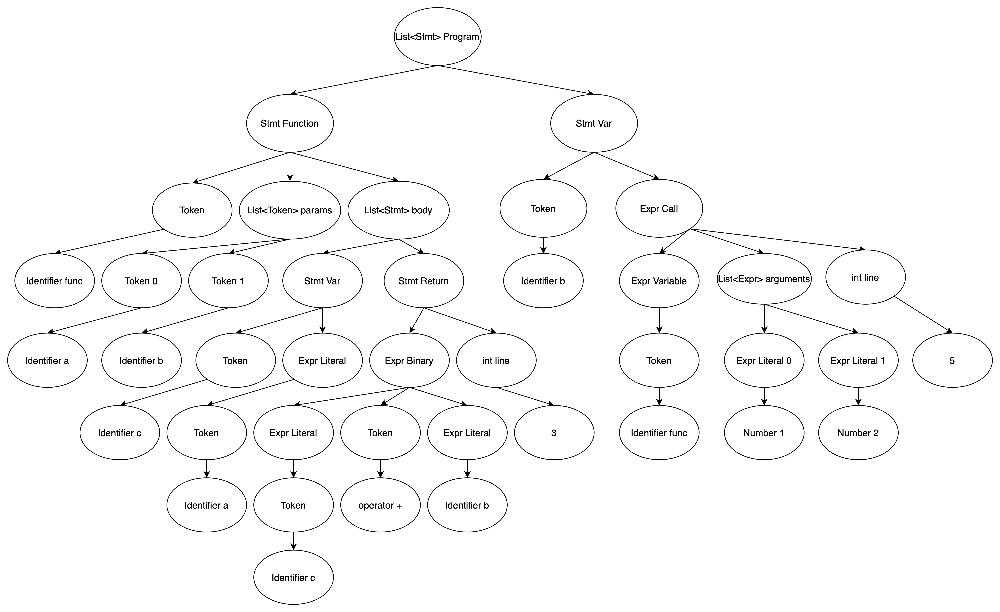

# Eagle语言设计说明书

吴晨灿 王艺坤

## 1. 语言的背景和目标

1. 设计背景
2. 设计目标
3. 语言名称由来（x）

* 动态类型，解释性语言，考虑了部分跨平台需求
* 参考：Lox，Python，Java，Scala，C++？

## 2. 词法设计

### 2.1 Token设计

在Eagle中，Token包括四个基本成员变量，分别是：

* TokenType type：Token类型标识符
* int line：Token出现的行数，用于错误检查
* string text：Token对应的字符串
* Object literal：当该Token为基本类型，则literal为具体基本类型，否则为nullptr
  * Object为Eagle内置实现的公共父类

### 2.2 TokenType设计

在Eagle，TokenType主要可以分为5大类，分别是算术运算符，关系运算符，字面量标识符，关键字和基本符号，另外还有一个辅助标识符，用于Parser语法解析时辅助使用。

TokenType的作用是区分Lexer词法解析的分析结果，在Parser中通过不同的TokenType来进行语法解析。

#### 2.2.1 算术运算符

| 字符串 | TokenType    | 说明                       |
| ------ | ------------ | -------------------------- |
| -      | MINUS        | 一元运算负号；二元运算减法 |
| +      | PLUS         | 二元运算加法               |
| *      | MULTI        | 二元运算乘法               |
| /      | DIV          | 二元运算除法               |
| %      | MOD          | 二元运算取余               |
| =      | ASSIGN       | 二元运算赋值               |
| -=     | MINUS_ASSIGN | 二元运算减法并赋值         |
| +=     | PLUS_ASSIGN  | 二元运算加法并赋值         |
| *=     | MULTI_ASSIGN | 二元运算乘法并赋值         |
| /=     | DIV_ASSIGN   | 二元运算除法并赋值         |
| %=     | MOD_ASSIGM   | 二元运算取余并赋值         |

* 在Eagle中，赋值运算是有返回值的，返回值为赋值后的结果，所以将赋值运算符归为算数运算符

#### 2.2.2 关系运算符

| 字符串 | TokenType     | 说明                             |
| ------ | ------------- | -------------------------------- |
| ==     | EQUAL         | 检查左右操作数是否相等           |
| !=     | NOT_EQUAL     | 检查左右操作数是否不相等         |
| <      | LESS          | 检查左操作数是否小于右操作数     |
| <=     | LESS_EQUAL    | 检查左操作数是否小于等于右操作数 |
| >      | GREATER       | 检查左操作数是否大于右操作数     |
| >=     | GREATER_EQUAL | 检查左操作数是否大于等于右操作数 |

#### 2.2.3 字面量标识符

| TokenType  | 说明                         |
| ---------- | ---------------------------- |
| IDENTIFIER | 标识符，如 a，abc            |
| NUMBER     | 数字，如 1，1.2              |
| STRING     | 字符串，如 "abcd"            |
| BOOLEAN    | 布尔值，如 true，false       |
| NIL        | 空，如nil                    |
| LIST       | 列表，如 [1, true, "123"]    |
| DICT       | 字典，如 {1: 2, true: "abc"} |
| TUPLE      | 元组，如 (a, function, 1)    |

* 字面量标识符，部分字面量标识符可以在Lexer词法解析时直接解析出来，部分字面量标识符需要在Parser语法解析时通过分析嵌套表达式来解析
  * Lexer直接解析：IDENTIFIER，NUMBER，STRING，BOOLEAN
  * Parser嵌套解析：LIST，DICT，TUPLE

#### 2.2.4 关键字

| 字符串   | TokenType | 说明                |
| -------- | --------- | ------------------- |
| var      | VAR       | var变量声明关键字   |
| and      | AND       | 二元逻辑运算与      |
| or       | OR        | 二元逻辑运算或      |
| not      | NOT       | 一元逻辑运算非      |
| nil      | NIL       | 基本类型，空关键字  |
| for      | FOR       | for循环关键字       |
| while    | WHILE     | while循环关键字     |
| break    | BREAK     | break跳出循环       |
| continue | CONTINUE  | continue持续循环    |
| if       | IF        | if条件关键字        |
| else     | ELSE      | else条件关键字      |
| switch   | SWITCH    | switch条件关键字    |
| case     | CASE      | case条件关键字      |
| default  | DEFAULT   | default条件关键字   |
| stream   | STREAM    | stream流处理关键字  |
| def      | DEF       | def函数声明关键字   |
| class    | CLASS     | class类声明关键字   |
| super    | SUPER     | super类操作关键字   |
| this     | THIS      | this类操作关键字    |
| extends  | EXTENDS   | extends类继承关键字 |
| print    | PRINT     | print输出关键字     |
| return   | RETURN    | return函数返回      |

#### 2.2.5 基本符号

| 字符串 | TokenType        | 说明     |
| ------ | ---------------- | -------- |
| ,      | COMMA            | 逗号     |
| .      | DOT              | 点       |
| ;      | SEMICOLON        | 分号     |
| ?      | QUESTION_MARK    | 问好     |
| !      | EXCLAMATION_MARK | 感叹号   |
| (      | LEFT_PAREN       | 左小括号 |
| )      | RIGHT_PAREN      | 右小括号 |
| [      | LEFT_BRACKET     | 左中括号 |
| ]      | RIGHT_BRACKET    | 右中括号 |
| {      | LEFT_BRACE       | 左大括号 |
| }      | RIGHT_BRACE      | 右大括号 |
| ->     | RIGHT_ARROW      | 右箭头   |

#### 2.2.6 辅助标识符

| TokenType | 说明                                             |
| --------- | ------------------------------------------------ |
| END       | 在词法解析结束后，在末尾添加END标识最后一个Token |

### 2.3 Lexer设计

Eagle解释器中的Lexer词法解析，采用手动构造的方式来实现，没有依赖第三方支持。

#### 2.3.1 处理逻辑

* Eagle解释器主要将输入分为五类进行处理
  1. 可直接识别的字符：包括算数运算符，关系运算符，基本符号等
  2. 数字：需要按照NUMBER对应的格式，识别完整的数字，并初始化数字对应的BigFloat Object对象，存储到Token的literal字段中
  3. 字符串：在识别到`"`符号后，进入字符串的解析，需要将完整的字符串初始化为对应的String Object对象中，存储到Token的literal字段中
  4. 关键字/标识符：关键字和标识符有一样的解析逻辑，需要在解析之后判断该标识符是否为Eagle的关键字，并赋予对应的TokenType
  5. 特殊字符：
     * `\n, \t, \r`和空格，符合Eagle字符规范的输入会进行忽略处理，其中`\n`会让line的计数增加
     * 不符合Eagle字符规范的输入，会在Lexer语法解析的时候**报错**

#### 2.3.2 处理过程


## 3. 语法设计

### 3.1 EBNF设计

#### 3.1.1 Program入口 EBNF设计

```cpp
program ::= (declaration|statement)* ;
```

#### 3.1.2 Statement EBNF设计

* 声明

```cpp
declaration :: = class-declaration |
				 function-declaration |
				 variable-declaration ;

class-declaration ::= "class" identifier ("extends" identifier)?
					  "{" (variable-declaration|function-declaration)* "}" ;

function-declaration ::= "def" identifier "(" parameters? ")" block-statement ;
parameters ::= identifier ("," identifier)* ;

variable-declaration ::= "var" identifier ("=" expression)? ";" ;
```

* 语句

```cpp
statement ::= if-statement |
			  for-statement |
              while-statement |
              expression-statement |
			  print-statement |
			  return-statement |
			  break-statement |
			  continue-statement |
			  block-statement |
			  empty-statement;

if-statement ::= "if" "(" condition ")" statement
				 ("else" statement)? ;

for-statement ::= "for" "(" 
				  (variable-declaration | expression-statement | ";")?
				  expression? ";"
				  expression? 
				  ")"
				  statement ;

while-statement ::= "while" "(" expression ")" statement ;

expression-statement ::= expression ";" ;

print-statement ::= "print" expression ";" ;

return-statement ::= "return" expression ";" ;

break-statement ::= "break" ";" ;

continue-statement ::= "continue" ";" ;

block-statement ::= "{" (declaration|statement)* "}" ;

empty-statement ::= ";" ;
```

#### 3.1.3 Expression EBNF设计

```cpp
// Expression
expression ::= assignment_expression ;

assignment_expression ::= call ("="|"+" "="|"-" "="|"*" "="|"/" "="|"%" "=") 		
						  assignment_expression | ternary_if_else ;

ternary_if_else ::= logic_or ("?" ternary_if_else ":" ternary_if_else)? ;

logic_or ::= logic_and ("or" logic_and)* ;

logic_and ::= comparison ("and" comparison)* ;

comparison ::= term (("=="|"!="|">"|">="|"<"|"<=") term)* ;

term ::= factor (("-"|"+") factor)* ;

factor ::= unary (("*"|"/"|"%") unary)* ;

unary ::= ("!"|"-"|"not") unary | call ;

call ::= primary ("." identifier | ("[" expression "]")+ | "(" arguments? ")")* ;

primary ::= "true" | "false" | "nil" | "this" | "super" "." identifier |
			number | string | identifier | "(" expression ")" |
			"[" list_elements? "]" | "{" dict_elements? "}" | "(" tuple_elements? ")" |
			stream_expression | switch_expression | lambda_expression ;
```

#### 3.1.4 基本单元 EBNF设计

```cpp
list_elements ::= expression ("," expression)* ;

dict_elements ::= expression ":" expression ("," expression ":" expression)* ;

tuple_elements ::= (expression ",")? | expression ("," expression)+ ;

stream_expression ::= "stream" "(" expression ")" ("." identifier "(" call? ")")* ;

switch_expression ::= "switch" "(" expression ")" "{"
					  ("case" expression ":" expression ",")*
					  "default" ":" expression "}" ;

lambda_expression ::= "(" parameters? ")" "->" (expression | block-statement) ;

arguments ::= expression ("," expression) ;

number ::= digit+ ("." digit+)? ;

digit ::= "0"..."9" ;

string ::= "\"" <any char except \">* "\""
  
identifier ::= alpha (alpha|digit)* ;

alpha ::= "a"..."z"|"A"..."Z"|"_" ;
```

### 3.2 AST抽象语法树设计

抽象语法树（AST）是通过Parser语法解析，将Lexer词法解析的结果构造为Eagle对应的语言成分，在Eagle中主要分为Expression和Statement两类

在Eagle的AST抽象语法树中，入口为Program，是一个List\<Statement\>，里面包含多个Statement AST节点。在Expression AST节点和Statement AST节点中，它们的节点组成主要为Token，Expression，Statement，

#### 3.2.1 Expression AST节点设计

```cpp
Assign 				: Token name, Token operator, Expr value
Ternary 			: Expr condition, Expr then_expr, Expr else_expr
Compare 			: Expr first, List<Pair<Token, Expr>> others
Binary 				: Expr left, Token operator, Expr right
Unary 				: Token operator, Expr expr
Call 				: Expr callee, List<Expr> arguments, int line
Literal 			: Object value
Variable 			: Token name
Stream 				: Expr expr, List<Pair<Token, Expr>> operations
Switch 				: Expr expr, List<Pair<Expr, Expr>> case_results, Expr default_result
Lambda				: List<Token> params, Stmt body
InstanceSet 		: Expr object, Token name, Token operator, Expr value
InstanceGet 		: Expr object, Token name
ContainerSet		: Expr container, Expr subscript, Token operator, Expr value
ContainerGet		: Expr container, Expr subscript
This 				: Token keyword
Super 				: Token keyword, Token method
Sequence 			: Token type, List<Expr> elements
Associative 		: Token type, List<Pair<Expr, Expr>> elements
```

#### 3.2.2 Statement AST节点设计

```cpp
Class 		: Token name, Variable super_class, List<Var> members, List<Function> methods
Function 	: Token name, List<Token> params, List<Stmt> body
Var 		: Token name, Expr initializer
If 			: Expr condition, Stmt then_branch, Stmt else_branch
While 		: Expr condition, Stmt body
For       	: Stmt initializer, Expr condition, Stmt increment, Stmt body 
Expression	: Expr expression
Print 		: Expr print_value
Return 		: Expr return_value, int line
Break 		: Token keyword
Continue 	: Token keyword
Block 		: List<Stmt> statements
Empty     	:
```

#### 3.2.3 Eagle AST样例说明

##### InstanceSet AST样例说明

```java
class A {
	var b = 1;
}
A().b += 2;
```


##### ContainerSet AST样例说明

```java
var b = {1: 2, 3: 4};
b[3] = "4";
```


##### Function AST样例说明

```cpp
def func(a, b) {
	var c = a;
	return c + b;
}
var b = func(1, 2);
```



##### For AST样例说明

```java
for (var a = 1; a < 10; a += 1) {
	print a;
}
```


## 4. 语义说明

### 4.1 存储域

Store是Eagle的存储域，描述的是程序运行时的堆内存的使用。Location用于描述存储域中存储数据的位置，使用Location和辅助函数fetch可以查询存储域中的值，使用Location和update函数可以更新存储域中的值，allocate，deallocate等辅助函数更新存储域的使用情况。

* 语义函数

```
Store = Location → (stored Storable + undefined + unused)
```

* 辅助函数

```
empty_store: Store
allocate: Store → Store × Location
deallocate: Store × Location → Store
update: Store × Location × Storable → Store
fetch: Store × Location → Storable
```

* 辅助函数符号表示

```
empty_store = λloc.unused
allocate(sto) = let loc = any_unused_location(sto) in (sto[loc → undefined], loc)
deallocate(sto, loc) = sto[loc → unused]
update(sto, loc, stble) = sto[loc → stored stble]
fetch(sto, loc) = let stored_value (stored stble) = stble
				  	  stored_value (undefined) = fail
				  	  stored_value (unused) = fail
				  	  in stored_value (sto(loc))
```

### 4.2 环境域

标识环境域Environ，标识符域Identifier，可绑定体域Bindable，环境特性的映射关系如下：

* 语义函数

```
Environ = Identifier → (bound Bindable + unbound)
```

* 辅助函数

```
empty_environ: Environ
bind: Identifier × Bindable → Environ
overlay: Environ × Environ → Environ
find: Environ × Identifier → Bindable
```

* 辅助函数符号表示

```
empty-environ = λI.unbound
bind(I, bdble) = λI'. if I' = I then bound bdble else unbound
overlay(env', env) = λI. if env'(I) != unbound then env'(d) else env(d)
find(env, I) = 
	let bound_value(bound bdble) = bdble
		bound_value(unbound) = fail
	in bound_value(env(I))
```

### 4.3 原始域表达式

Primary原始域中包含：真值域Boolean，空值域Nil，字符串域String，数值域Number，容器域Container，标识符域Identifier。

* 语义函数

```
Primary = Value → (Boolean + Nil + String + Number + Container + Identifier)
```

* 辅助函数

```
fetch_variable: Store × Identifier → Value
instance_get: Identifier × Bindable × Identifier → Value
container_get: Environ × Identifier × Expression → Value
```

* 辅助函数符号表示

```
fetch_variable(sto, variable loc) = fetch(sto, loc)
instance_get(instance, env, member) = 
	let instance_sto = find(env, instance) in
	fetch_variable(instance_sto, member)
container_get(container, env, index) = 
	let container_sto = find(env, container) in
	fetch_variable(container_env, index)
```

### 4.4 表达式

使用Expression来表示表达式域，表达式主要可以分为赋值表达式，算术表达式，关系表达式和逻辑表达式。

* 语义函数

```
evaluate: Expression → (Environ → Store → Value)
```

* 辅助函数

```
update_variable: Store × Identifier × Value → Store
// 赋值表达式
instance_set: Identifier × Bindable × Identifier × Value → Environ
container_set: Environ × Identifier × Expression × Value → Environ
// 算术表达式
plus: Value × Value → Value
minus: Value × Value → Value
multi: Value × Value → Value
div: Value × Value → Value
mod: Value × Value → Value
// 关系表达式
equal: Value × Value → Boolean
not_equal: Value × Value → Boolean
less: Value × Value → Boolean
less_equal: Value × Value → Boolean
greater: Value × Value → Boolean
greater_equal: Value × Value → Boolean
// 逻辑表达式
not: Boolean → Boolean
and: Boolean × Boolean → Boolean
or: Boolean × Boolean → Boolean
```

* 辅助函数符号表示

```
update_variable(sto, variable loc, stble) = update(sto, loc, stble)
// 赋值表达式
instance_set(instance, env, member, sto, value) = 
	let instance_var = intance_get(instance, env, member) in
	update_variable(sto, instance_var, value)
container_set(container, env, index, sto, value) =
	let container_var = container_get(container, env, index) in
	update_variable(sto, container_var, value)
// 算术表达式
plus(left, right) = left + right
minus(left, right) = left - right
multi(left, righ) = left * right
divide(left, right) = left / right
mod(left, right) = left % right
// 关系表达式
equal(left, right) = 
	if left == right
	then true
	else false
not_equal(left, right) = 
	if left != right
	then true
	else false
less(left, right) =
	if left < right
	then true
	else false
less_equal(left, right) =
	if left <= right
	then true
	else false
greater(left, right) =
	if left > right
	then true
	else false
greater_equal(left, right) =
	if left >= right
	then true
	else false
// 逻辑表达式
not(value) = !value
and(left, right) =
	if left == true && right == true
	then true
	else false
or(left, right) = 
	if left == true || right == true
	then true
	else false
```

* 语义方程

```
// 赋值表达式
evaluate [I = E] env sto =
	let val = evaluate E env sto in
	update_variable(sto, I, val)
evaluate [I.member = E] env sto =
	let val = evaluate E env sto in
	instance_set(I, env, member, sto, val)
evaluate [I[E1] = E2] env sto = 
	let index = evaluate E1 env sto in
	let val = evaluate E2 env sto in
	container_set(I, env, index, sto, val)
// 算术表达式
evaluate [E1 + E2] env sto =
	let left = evaluate E1 env sto in
	let right = evaluate E2 env sto in
	plus(left, right)
evaluate [E1 - E2] env sto =
	let left = evaluate E1 env sto in
	let right = evaluate E2 env sto in
	minus(left, right)
evaluate [E1 * E2] env sto =
	let left = evaluate E1 env sto in
	let right = evaluate E2 env sto in
	multi(left, right)
evaluate [E1 / E2] env sto =
	let left = evaluate E1 env sto in
	let right = evaluate E2 env sto in
	divide(left, right)
evaluate [E1 % E2] env sto =
	let left = evaluate E1 env sto in
	let right = evaluate E2 env sto in
	mod(left, right)
// 关系表达式
evaluate [E1 == E2] env sto =
	let left = evaluate E1 env sto in
	let right = evaluate E2 env sto in
	equal(left, right)
evaluate [E1 != E2] env sto =
	let left = evaluate E1 env sto in
	let right = evaluate E2 env sto in
	not_equal(left, right)
evaluate [E1 < E2] env sto =
	let left = evaluate E1 env sto in
	let right = evaluate E2 env sto in
	less(left, right)
evaluate [E1 <= E2] env sto =
	let left = evaluate E1 env sto in
	let right = evaluate E2 env sto in
	less_equal(left, right)
evaluate [E1 > E2] env sto =
	let left = evaluate E1 env sto in
	let right = evaluate E2 env sto in
	greater(left, right)
evaluate [E1 >= E2] env sto =
	let left = evaluate E1 env sto in
	let right = evaluate E2 env sto in
	greater_equal(left, right)
// 逻辑表达式
evaluate [not E] env sto =
	let value = evaluate E env sto in
	not(value)
evaluate [E1 and E2] env sto =
	let left = evaluate E1 env sto in
	let right = evaluate E2 env sto in
	and(left, right)
evaluate [E1 or E2] env sto =
	let left = evaluate E1 env sto in
	let right = evaluate E2 env sto in
	or(left, right)
// switch-case表达式
evaluate [switch(E) case E1: V1, case E2: V2, default V3] env sto =
	let condition = evaluate E env sto in
	let case_1 = evaluate E1 env sto in
	if condition == case_1
	then evaluate V1
	else
	let case_2 = evaluate E2 env sto in
	if condition == case_2
	then evaulate V2
	else
	evaluate V3
// 其他表达式
evaluate [(E)] env sto = evaluate E env sto
```

### 4.5 语句

* 使用Statement来表示语句域，语句主要可以分为条件语句，循环语句，表达式语句，输出语句，空语句。

* 语义函数

```
execute: Statement → (Environ → Store → Store)
```

* 语义方程

```
execute [if C then S1 else S2] env sto = 
	if evaluate C env sto = Boolean true
	then execute S1 env sto
	else execute S2 env sto
execute [for (S1; C; S2) S3] env sto =
	execute S1 env sto
	let execute_for env sto = 
		if evaluate C env sto = Boolean true
		then execute_for env (execute S2 env sto (execute S3 env sto))
		else sto
	in
	execute_for
execute [while C do S] env sto = 
	let execute_while env sto =
		if evaluate C env sto = Boolean true
		then execute_while env (execute S env sto)
		else sto
	in
	execute_while
execute [E] env sto = evaluate E env sto
execute [print E] env sto =
	let output = evaluate E env sto in
	print output
execute [] env sto = sto
```

### 4.6 声明

* 在Eagle中声明分为变量声明，函数声明和类的声明

#### 变量

* 语义方程

```
execute [var V = E] env sto =
	let var = identifier V env sto in
	let val = evaluate E env sto in
	update_variable(allocate(sto), var, val)
```

#### 函数

在Eagle关于函数，分为函数的声明与形式参数Formal Parameters，以及函数的调用与实际参数Actual Parameters。

* 函数抽象

```
Function = Argument → Value
Function = Argument → Store → Value
```

* 辅助函数

```
bind_parameter: Formal_Parameter → (Argument → Environ)
give_argument: Actual_Parameter → (Environ → Argument)
```

* 辅助函数符号表示

```
bind_parameter(I, arg) = bind(I, arg)
give_argument(E) env sto = let arg = evluate E env sto
```

* 语义方程

```
// 函数声明
execute [def I(FP) S] env =
	let func arg =
		let parenv = bind_parameter(I, FP) in
		evaluate S(overlay(parenv, env))
	in
	(bind(I, def func))
// 函数调用
evaluate [I(AP)] env =
	let function func = find(env, I) in
	let arg = give_argument(AP) env in
	func arg
```

#### 类

* 类抽象

 ```
 Class = Class_Declaration → (Environ → Store → Environ × Store)
 ```

* 语义方程

```
execute [class I1 extends I2 VD FD] env sto =
	let super_class = find(env, I2) in
	let class sto' = 
		let env = overlay(bind(I, class class), overlay(super_class, env)) in
		let variables = execute VD env sto
		let functions = execute FD env sto
		in
		(bind(I1, class class), sto')
```

## 5. 对标语言差异


## 6. 实现细节

1. Object
2. 内置类
2. 内置方法
3. 类与实例
3. Return, Break, Continue实现
4. 方法 / lambda
5. Visitor模式
6. EagleShell
7. pretty_print
8. 支持用户自定义toString, equals, hashcode, isTruthy
8. 多平台适配

## 7. 验证与测试

1. 基本功能
   1. 类使用
   2. 容器使用
   3. ...
2. 错误示例